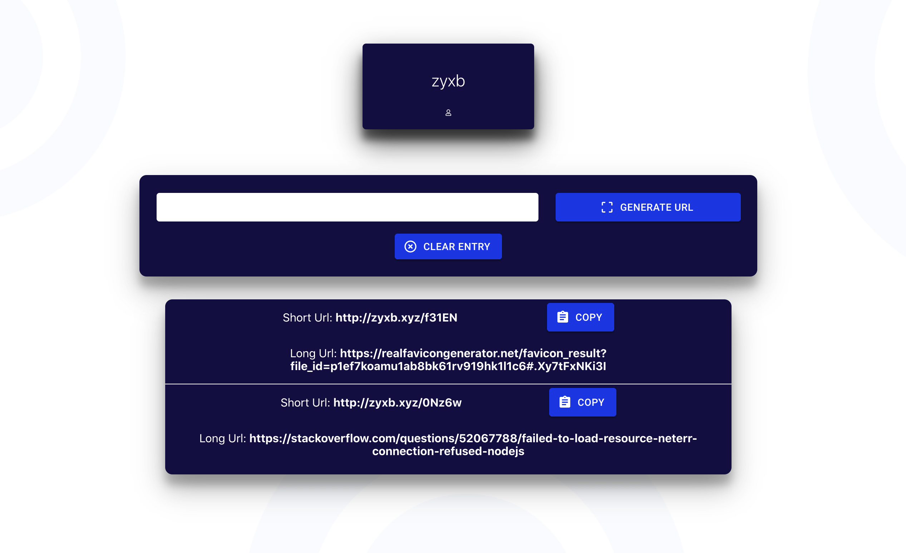

# zyxb

Speedy url shortner



## Usage

Rename "dummy.env" to "config.env" in /config and update the values to your own

## Install Dependencies

```
npm install
```

## Run app

```
# Run in dev mode
npm run dev

# Run frontend
npm run client

# Run backend
npm run server
```

- Version: 1.0
